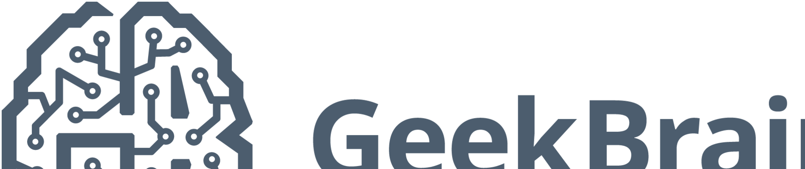

# GeekBrains Competitive Data Analysis 
## Итоговый проект по курсу «Спортивный анализ данных, платформа kaggle»

**Description / Задание:**

Для построения модели в данном соревновании, сначала нужно будет собрать выборку для обучения модели. Формат соревнования очень похож на то, как в промышленности Data Scinetist'ы строят алгоритмы: сначала нужно провести анализ данных, собрать выборку и после этого строить модели. В соревновании представлены 4 типы источника данных, которые могут быть интерпретированы как таблицы в базе данных. Некоторые источники данных уже готовы для моделирования, представлены в агрерированном виде. Другие источники данных требуется представить в удобном для модели виде.

**Target / Целевая переменная:**

TARGET / Целевая переменная

**Evaluation / Метрика для оценки:**

Метрикой качества в данной задаче является метрика **ROC-AUC**  

**File descriptions / Описание файлов:**  
train.csv - пары "заявка - целевая переменная", для этой выборки нужно собрать признаки и обучить модель;  
test.csv - пары "заявки - прогнозное значение", для этой выборки нужно собрать признаки и построить прогнозы;  
bki.csv - данные БКИ о предыдущих кредитах клиента;  
client_profile.csv - клиентский профиль, некоторые знания, которые есть у компании о клиенте;  
payments.csv - история платежей клиента;  
applications_history.csv - история предыдущих заявок клиента.  

**Public Leaderboard:**  
Score - 0.73693  

**Official Website: https://www.kaggle.com/c/geekbrains-competitive-data-analysis**
