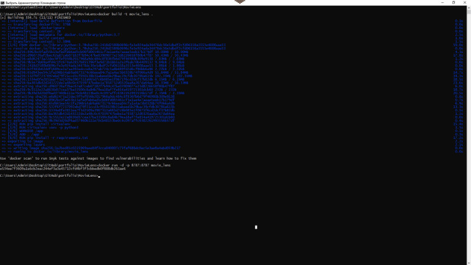

<h1>Recommendation Systems on MovieLens</h1>



##

<p align="left">
  
  
  
  
  
</p>  

<h2>Description:</h2> 
Построить рекомендательную модель, обучить используя дата-сет представленный выше и оценить модель. Нужно так же учитывать название фильмов/жанров при рекомендации.  

Решение предоставить в виде jupyter notebooks (построение модели или использование существующей, обучение)
Так же реализовать простенький REST сервис принимающий на вход user_id (id пользователя) и на выход отдает ответ по рекомендуемым items для этого пользователя (с вычисткой того что он смотрел)

Пример: 
{  
  "body": [
      12,
      13,
      14,
      2193
    ]   
}  


Сервис реализовать на Python. При использовании фреймворка предпочтение отдаётся Flask.
Результат прислать в виде ссылки на git репозиторий с инструкцией по установке. Можно так же попробовать контейнеризировать приложение с помощью docker.

<h2>Technology Stack:</h2>
ML: Sklearn, Pandas, Numpy

API: Flask  
  
<h2>Data Set Information:</h2> 
http://files.grouplens.org/datasets/movielens/ml-latest-small.zip   

[**README**](https://github.com/alexeytankov/portfolio/blob/master/MovieLens/data/README.txt) - Описание датасета в архиве.


<h2>Use the Docker command line</h2>  

### Clone repository and create project
```
$ git clone https://github.com/alexeytankov/portfolio/blob/master/MovieLens
$ go to your project directory to build it
$ docker build -t movie_lens .
```

### Run docker
```
$ docker run -d -p 8787:8787 movie_lens
```

### Go to http://localhost:8787 or http://127.0.0.1:8787/ 
